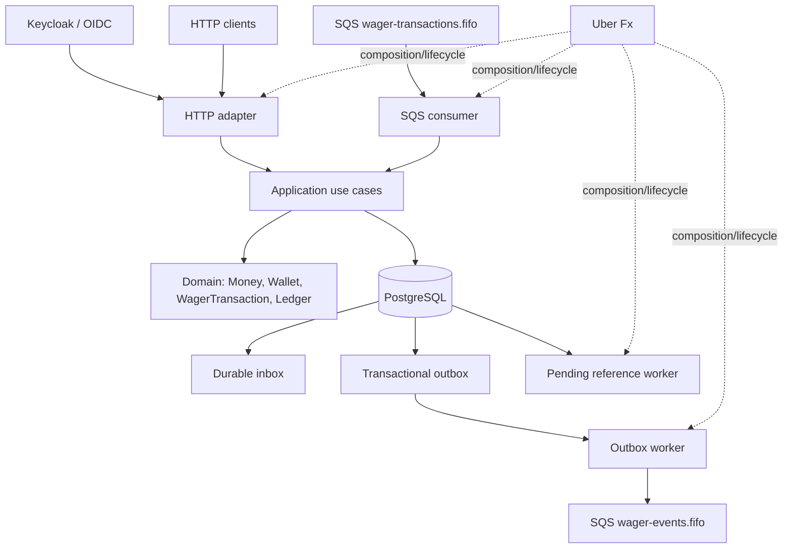

# distributedBettingProcessing

`distributedBettingProcessing` é um backend distribuído para processamento de
transações de apostas. A aplicação pode ser executada em múltiplas instâncias,
recebendo operações por HTTP e por SQS, enquanto PostgreSQL permanece como a
fonte durável da verdade financeira.

O projeto trata dinheiro exato, concorrência por carteira, idempotência,
reversões, referências que chegam posteriormente e entrega de mensagens
at-least-once. Inbox, outbox, retries, leases e workers de referência cobrem
as janelas intermediárias entre persistência, processamento, publicação e
redelivery.

A proposta de construção é explorar como manter invariantes explícitos em um
sistema financeiro distribuído, com evidência reproduzível e tolerância a
falhas intermediárias. A implementação foi validada por testes unitários,
integrações reais e cenários controlados de falha.

O ciclo final de quality gate e Human Review foi concluído sem findings
abertos. `CHALLENGE.md` permanece a fonte primária original; os demais
documentos descrevem a implementação e suas decisões derivadas.

## Principais garantias

- `Money` usa aritmética exata em unidades mínimas, sem `float32` ou `float64`.
- Entradas financeiras usam representação decimal fixa de duas casas e moeda.
- O saldo da wallet não fica negativo; alterações de saldo e ledger são atômicas.
- O ledger é append-only e cada mutação efetiva produz um lançamento correspondente.
- Idempotência é persistida no PostgreSQL e sobrevive a restart e múltiplas instâncias.
- Wallets são serializadas por row lock; wallets independentes podem progredir em paralelo.
- A inbox SQS é durável e o `DeleteMessage` ocorre somente após commit durável.
- A outbox é criada na mesma transação do estado que descreve e publicada depois do commit.
- `eventId` permanece estável em retry e republicação.
- O ordering de eventos do mesmo aggregate é persistido no PostgreSQL.
- `PENDING_REFERENCE` sobrevive a restart e pode ser resolvido ou rejeitado por exhaustion.
- O isolamento por `providerId` vem da identidade autenticada, não do payload recebido.
- Recovery de processo, banco, SQS, inbox e outbox é exercitado pelos testes de Failure Engineering.

## Dependências

| Dependência | Uso | Documentação |
| --- | --- | --- |
| Go 1.27.1 ou superior conforme `go.mod` | Compilação, aplicação e testes | [go.dev/doc/install](https://go.dev/doc/install) |
| GNU Make | Interface operacional do projeto | [gnu.org/software/make](https://www.gnu.org/software/make/) |
| Podman + `podman compose` ou Docker Compose | PostgreSQL, LocalStack e Keycloak | [Podman](https://podman.io/docs/installation), [podman-compose](https://github.com/containers/podman-compose), [Docker Compose](https://docs.docker.com/compose/install/) |
| `golang-migrate/migrate` | Aplicação e reversão das migrations | [github.com/golang-migrate/migrate](https://github.com/golang-migrate/migrate/tree/master/cmd/migrate) |
| `curl` | Health checks, readiness e bootstrap dos testes | [curl.se/download.html](https://curl.se/download.html) |
| `jq` | Extração do token nos exemplos HTTP | [jqlang.org/download](https://jqlang.org/download/) |

Os executáveis `go`, `gofmt` e `migrate` precisam estar disponíveis no
`PATH` para executar os comandos literalmente como escritos. Verifique-os com:

```bash
go version
gofmt --help
migrate -version
```

`gofmt` faz parte do toolchain Go e não é instalado separadamente. Para uma
verificação sem efeitos colaterais, use:

```bash
make doctor
```

Se `migrate` estiver ausente, instale somente a ferramenta auxiliar versionada
via Go e repita a verificação:

```bash
make install-go-tools
make doctor
```

O target não instala Go, não usa `sudo` e não altera arquivos de shell. Se o
binário for instalado em `$(go env GOPATH)/bin`, adicione esse diretório ao
`PATH` conforme a instrução exibida.

O ambiente de referência validado usou Podman 5.8.4 e `podman-compose` 1.6.0.
O Makefile prefere `podman compose` quando disponível e usa `docker compose`
como fallback. Docker Compose foi inspecionado como compatibilidade, mas não
foi executado neste ambiente.

`golang-migrate/migrate` é uma dependência externa intencional. O Makefile
não instala ferramentas nem faz download oculto durante o bootstrap.

## Instalação local

### 1. Clonar

```bash
git clone https://github.com/LeoCosta-dev/distributedBettingProcessing.git
cd distributedBettingProcessing
```

### 2. Configurar o ambiente

```bash
cp .env.example .env
```

Os valores do `.env.example` são voltados ao ambiente local: PostgreSQL em
`localhost:5432`, LocalStack em `localhost:4566`, Keycloak em
`localhost:8082` e a API em `localhost:8080`. O arquivo também define os
nomes das filas, parâmetros de retry, leases, endpoints OIDC e credenciais
locais de desenvolvimento.

Se forem usados outros ports ou credenciais, forneça uma `DATABASE_URL` e os
parâmetros correspondentes ao Makefile/Compose explicitamente. Não use os
valores locais de exemplo em deployment.

### 3. Verificar dependências

```bash
go version
make --version
migrate -version
podman --version
podman compose version
```

Com Docker Compose, substitua os dois últimos comandos por:

```bash
docker --version
docker compose version
```

### 4. Subir a infraestrutura

```bash
make up
```

O target inicia PostgreSQL, LocalStack e Keycloak. A detecção automática usa
Podman primeiro e Docker Compose depois. O runtime também pode ser escolhido
explicitamente:

```bash
make CONTAINER_RUNTIME=podman up
make CONTAINER_RUNTIME=docker up
```

O Compose importa o realm `wagering` do Keycloak e o bootstrap do LocalStack
cria:

- `wager-transactions.fifo`;
- `wager-transactions-dlq.fifo`, com a redrive policy da fila principal;
- `wager-events.fifo`.

### 5. Bootstrap

```bash
make migrate-check
make bootstrap
```

`make bootstrap` espera PostgreSQL, LocalStack e Keycloak, informa que as
filas e o realm são provisionados automaticamente pelos containers e aplica
as migrations versionadas usando `migrate`.

Em uma máquina sem a CLI, `make migrate-check` falha explicitamente e indica
`make install-go-tools`. Em um terminal interativo, o target pergunta antes de
executar a instalação:

```bash
go install -tags 'postgres' github.com/golang-migrate/migrate/v4/cmd/migrate@latest
```

Em ambiente não interativo, nenhuma instalação é iniciada e o target falha
indicando `make install-go-tools`. Se o binário for instalado em
`$(go env GOPATH)/bin`, esse diretório precisa estar no `PATH` para os comandos
`migrate -version`, `make doctor` e `make migrate-check` serem encontrados
diretamente. Nenhum dado é alterado pelo target. As migrations podem ser
aplicadas e revertidas uma etapa por vez:

```bash
make migrate-up
make migrate-down
make migrate-up
```

`000003_opening_transaction.down.sql` recusa remover o suporte a `OPENING`
quando houver transações de abertura, pois esse rollback apagaria a origem
financeira. Não remova dados financeiros para fazer uma migration reverter.

### 6. Executar a aplicação

```bash
make run
```

Esse target inicia `cmd/api` no host em `:8080` e configura os endpoints
locais de PostgreSQL, LocalStack e Keycloak. Ele não sobe a infraestrutura
implicitamente; execute `make up` e `make bootstrap` antes.

### 7. Verificar a aplicação

```bash
make health
make ready
```

`/health/live` indica que o processo está vivo. `/health/ready` verifica as
dependências necessárias, incluindo PostgreSQL e SQS. Metrics não substitui
nenhum dos dois checks.

## Usando a aplicação

Os exemplos abaixo usam as identidades e o realm provisionados por
`infra/keycloak/wagering-realm.json`. Os usuários e o client são somente para
desenvolvimento local.

Os blocos de shell abaixo usam Bash.

### Obter um token no Keycloak

O realm é `wagering`, o client é `wagering-api` e o fluxo de teste usa
`direct access grants`:

- `provider-alpha`, role `provider`, claim `provider_id=provider-alpha`;
- `provider-beta`, role `provider`, claim `provider_id=provider-beta`;
- `wallet-admin`, role `internal`, sem identidade de provider.

Todos usam a senha local `dev-only-pass`; o client usa `change-me`.

```bash
TOKEN_URL='http://localhost:8082/realms/wagering/protocol/openid-connect/token'

token() {
  curl -fsS -X POST "$TOKEN_URL" \
    -H 'Content-Type: application/x-www-form-urlencoded' \
    --data-urlencode 'grant_type=password' \
    --data-urlencode 'client_id=wagering-api' \
    --data-urlencode 'client_secret=change-me' \
    --data-urlencode "username=$1" \
    --data-urlencode 'password=dev-only-pass' |
    jq -er '.access_token'
}

INTERNAL_TOKEN="$(token wallet-admin)"
PROVIDER_TOKEN="$(token provider-alpha)"
```

O token é mantido em variáveis shell e não precisa ser impresso.

### Criar uma wallet

A abertura é uma operação interna e exige a role `internal`:

```bash
WALLET_RESPONSE="$(
  curl -fsS -X POST http://localhost:8080/wallets \
    -H "Authorization: Bearer $INTERNAL_TOKEN" \
    -H 'Content-Type: application/json' \
    --data '{"playerId":"player-001","initialBalance":{"amount":"100.00","currency":"BRL"}}'
)"
WALLET_ID="$(printf '%s' "$WALLET_RESPONSE" | jq -er '.id')"

printf 'wallet criada: %s\n' "$WALLET_ID"
```

Um saldo inicial positivo cria uma operação `OPENING`, seu crédito no ledger e
os eventos financeiros correspondentes no mesmo commit. Um saldo inicial
`0.00` cria a wallet sem `OPENING`, ledger ou eventos de mutação financeira.
O par `(playerId, currency)` identifica uma única wallet.

### Executar uma `BET`

O `providerId` do corpo deve ser igual ao `provider_id` do token autenticado.
O header `Idempotency-Key` é obrigatório:

```bash
BET_BODY='{"providerId":"provider-alpha","externalTransactionId":"bet-001","playerId":"player-001","walletId":"'"$WALLET_ID"'","roundId":"round-001","gameId":"game-001","kind":"BET","money":{"amount":"25.00","currency":"BRL"}}'

curl -fsS -X POST http://localhost:8080/wagering/transactions \
  -H "Authorization: Bearer $PROVIDER_TOKEN" \
  -H 'Idempotency-Key: provider-alpha:bet-001' \
  -H 'Content-Type: application/json' \
  --data "$BET_BODY"
```

O resultado processado contém `transactionId`, `status`, `amount`, `balance` e
`idempotentReplay`. A operação aceita os tipos externos `BET`, `WIN`, `LOSS`,
`REFUND` e `ROLLBACK`; `OPENING` é interno e não pode ser enviado por HTTP ou
SQS.

### Replay idempotente

Repita exatamente a mesma requisição, inclusive o `Idempotency-Key` e o corpo:

```bash
curl -fsS -X POST http://localhost:8080/wagering/transactions \
  -H "Authorization: Bearer $PROVIDER_TOKEN" \
  -H 'Idempotency-Key: provider-alpha:bet-001' \
  -H 'Content-Type: application/json' \
  --data "$BET_BODY"
```

O servidor devolve o resultado persistido com `idempotentReplay: true`. Não há
segundo movimento de wallet, lançamento de ledger ou evento financeiro. O
saldo devolvido é o snapshot observado no processamento original, não uma
reconstrução a partir do saldo atual.

### Conflito de idempotência

Reutilizar a mesma chave com outro payload de negócio é conflito:

```bash
curl -i -X POST http://localhost:8080/wagering/transactions \
  -H "Authorization: Bearer $PROVIDER_TOKEN" \
  -H 'Idempotency-Key: provider-alpha:bet-001' \
  -H 'Content-Type: application/json' \
  --data "${BET_BODY/25.00/30.00}"
```

A resposta usa o envelope de erro com `error.code=IDEMPOTENCY_CONFLICT` e
status HTTP `409`. A identidade `(providerId, externalTransactionId)` também
é persistida; tentar reaplicar a mesma operação de negócio com outra chave não
cria um segundo processamento.

### Consultar wallet, transação e ledger

As rotas de administração de wallet exigem a role `internal`:

```bash
curl -fsS "http://localhost:8080/wallets/$WALLET_ID" \
  -H "Authorization: Bearer $INTERNAL_TOKEN"

curl -fsS "http://localhost:8080/wallets/$WALLET_ID/ledger?limit=50" \
  -H "Authorization: Bearer $INTERNAL_TOKEN"
```

As consultas de transação exigem um token de provider e são filtradas pelo
provider autenticado:

```bash
curl -fsS "http://localhost:8080/wagering/transactions/$TRANSACTION_ID" \
  -H "Authorization: Bearer $PROVIDER_TOKEN"

curl -fsS "http://localhost:8080/providers/provider-alpha/wagering/transactions/bet-001" \
  -H "Authorization: Bearer $PROVIDER_TOKEN"
```

O ledger usa cursor opaco e `limit`. Estados `PENDING_REFERENCE`, `PROCESSED`,
`REJECTED` e códigos como `REFERENCE_REQUIRED`, `REFERENCE_NOT_FOUND`,
`REFERENCE_NOT_RESOLVED`, `REFERENCE_NOT_SUCCESSFUL` e `REFERENCE_INVALID`
permanecem consultáveis nas transações.

Reconciliação é uma comparação read-only entre a wallet persistida e a soma
reconstruída do ledger:

```bash
curl -fsS -X POST "http://localhost:8080/wallets/$WALLET_ID/reconciliation" \
  -H "Authorization: Bearer $INTERNAL_TOKEN"
```

Uma divergência é reportada na resposta, nos logs e em uma métrica; a rota
não corrige nem altera o estado financeiro.

### Fluxo SQS

O processo iniciado por `make run` consome `wager-transactions.fifo` com long
polling e usa o mesmo application use case do fluxo HTTP. A mensagem contém
`messageId`, `type`, `occurredAt` e `data`; a chave financeira é
`data.idempotencyKey` e a inbox usa `(consumerName, messageId)`.

`wager-transactions-dlq.fifo` recebe mensagens após o limite de receives
configurado pelo broker. `wager-events.fifo` recebe eventos da outbox. Não há
um utilitário de publicação manual no projeto; as filas são provisionadas pelo
bootstrap do LocalStack e os workers são iniciados pela aplicação.

## Como testar

### Testes padrão

```bash
make test
```

Executa `go test -count=1 ./...`.

### Race detector

```bash
make test-race
```

Executa `go test -race -count=1 ./...`.

### Vet

```bash
make vet
```

Executa `go vet ./...`.

### Quality gate rápido

```bash
make check
```

Verifica `gofmt -l .`, executa os testes padrão, executa `go vet ./...` e
executa `git diff --check`. O target não faz commit.

### Integrações reais

```bash
make integration
```

O target sobe as dependências locais, espera PostgreSQL, LocalStack e Keycloak,
confere o schema aplicado e habilita explicitamente os testes de integração.
Ele exercita, quando aplicável:

- PostgreSQL, constraints e transações reais;
- LocalStack, SQS FIFO, inbox, redelivery, DLQ/redrive e outbox;
- Keycloak, OIDC e fluxo HTTP autenticado;
- composição e lifecycle do Uber Fx;
- pending references e recovery;
- múltiplos pools e processos independentes;
- concorrência, ordering e idempotência.

O target não transforma `t.Skip` em evidência: as integrações condicionais são
habilitadas por variáveis explícitas e os testes precisam executar para o
comando passar.

### Failure Engineering

```bash
make failure-tests
```

Executa os testes reais do Loop 11 para:

- crash antes do commit SQL;
- commit da inbox, crash antes de `DeleteMessage` e redelivery;
- `SendEvent`, crash antes de `MarkPublished` e lease recovery;
- falha e recovery de PostgreSQL;
- indisponibilidade temporária e recovery de SQS.

Os cenários usam processos-filhos isolados e sincronização determinística.
Não é necessário nem recomendado matar processos manualmente.

### Outros targets operacionais

```bash
make help
make logs
make down
make clean
make clean-all CONFIRM=yes
```

`make down` para a stack sem remover volumes. `make clean` remove somente o
cache de testes Go. `make clean-all` remove volumes PostgreSQL/LocalStack e
exige `CONFIRM=yes` explicitamente.

## Arquitetura



- **HTTP adapter:** autentica, autoriza e traduz requests para commands; não contém regras financeiras.
- **SQS consumer:** valida o envelope, registra a inbox e chama o mesmo use case usado por HTTP.
- **Application:** coordena transações, idempotência, referências e resultados persistidos.
- **Domain:** mantém `Money`, `Wallet`, `WagerTransaction` e ledger independentes de infraestrutura.
- **PostgreSQL:** mantém estado financeiro, constraints, locks, inbox, pending references e outbox.
- **Reference worker:** resolve `PENDING_REFERENCE` de forma durável.
- **Outbox worker:** publica snapshots persistidos de forma assíncrona.
- **Keycloak:** fornece tokens OIDC e a identidade autenticada do provider.
- **Uber Fx:** compõe dependências e ordena startup/shutdown dos servidores e workers.
- **LocalStack:** fornece SQS local para integração; não representa enforcement de AWS IAM.

O código está organizado principalmente em `domain`, `application`,
`infrastructure`, `transport`, `observability` e `composition`. O domínio não
importa HTTP, SQS, PostgreSQL, Keycloak ou Uber Fx.

Os eventos de integração incluem `WagerTransactionProcessed`,
`WagerTransactionRejected`, `WalletBalanceChanged` e
`WagerTransactionPendingReference`. Cada evento leva envelope versionado,
`eventId` estável e snapshot imutável em `data`.

## Decisões técnicas

### Locks PostgreSQL em vez de mutex local

O lock da wallet é um `SELECT ... FOR UPDATE` dentro da transação financeira.
Isso coordena processos independentes, evita lost updates e permite que
wallets diferentes avancem em paralelo. Um mutex Go protegeria somente uma
instância e não pode ser o mecanismo de correção.

### Idempotência persistente

O PostgreSQL persiste a chave, a identidade de negócio, o hash, o estado e o
resultado. Assim, replay após restart ou em outra instância devolve o resultado
original sem reconstruir a resposta a partir do saldo atual.

### Ledger append-only

Lançamentos são imutáveis e a reconciliação reconstrói o saldo a partir deles.
Correções criam novos lançamentos; não editam nem removem o histórico.

### Inbox durável

SQS oferece entrega at-least-once. A inbox com unicidade
`(consumerName, messageId)` registra a entrega no banco, compara o hash em
redeliveries e impede reaplicação financeira. A mensagem só é removida depois
do commit durável.

### Transactional outbox

Estado financeiro, ledger e outbox são gravados na mesma transação quando
aplicável. O publisher executa depois do commit; se houver falha entre o
`SendMessage` e `MarkPublished`, a row continua recuperável.

### `eventId` estável

Retries, leases recuperadas e publishers diferentes reutilizam o `eventId` e
o payload persistidos. O modelo continua sendo at-least-once: consumidores
downstream precisam deduplicar por identidade estável. SQS FIFO não é tratado
como garantia financeira permanente.

### Ordering por aggregate

Cada row da outbox recebe `ordering_id` durável. Um evento só fica elegível
quando todos os predecessores do mesmo `aggregate_id` estão `PUBLISHED`.
Assim, o banco impede que publishers concorrentes invertam a ordem antes que
`MessageGroupId` seja aplicado no SQS. Um predecessor `FAILED` bloqueia os
sucessores até reparo ou republicação operacional; isso evita publicar um
histórico incompleto.

### `PENDING_REFERENCE`

REFUND e ROLLBACK podem chegar antes da referência existir. A operação é
persistida como `PENDING_REFERENCE`, recebe retry com backoff e é retomada por
um worker após restart. Ausência permanente termina em `REJECTED` com código
estável; referência incompatível ou não bem-sucedida recebe o código
correspondente.

### Separação de camadas

Transportes traduzem protocolos. Application use cases coordenam transações e
persistência. O domínio concentra invariantes. Infrastructure implementa
PostgreSQL, SQS e Keycloak. Essa separação permite verificar regras financeiras
sem acoplar o domínio a HTTP ou a um broker.

### Uber Fx e lifecycle

Workers possuem contextos e cancelamentos próprios, independentes do contexto
temporário de `OnStart`. No shutdown, polling para, trabalho em andamento é
concluído ou liberado para retry e as dependências permanecem abertas até os
workers encerrarem.

### Metrics process-local

`GET /metrics` expõe texto compatível com Prometheus com labels limitadas. Os
counters são diagnósticos da instância e zeram no restart; não são um state
store financeiro nem uma visão agregada do cluster.

## Failure Engineering

Os testes do Loop 11 atacam janelas entre operações que normalmente aparecem
como uma única linha de código:

1. um processo é encerrado por `SIGKILL` antes do commit SQL;
2. a inbox é commitada, o processo morre antes de `DeleteMessage` e outro consumer recebe a mensagem;
3. o broker aceita `SendEvent`, o publisher morre antes de `MarkPublished` e outro publisher recupera o lease;
4. PostgreSQL fica indisponível e volta a responder;
5. SQS fica temporariamente indisponível e o retry recupera o evento.

Esses testes usam PostgreSQL/LocalStack reais quando a fronteira exige isso,
processos-filhos separados e sincronização determinística. Eles provam
rollback, redelivery, lease recovery e estabilidade de identidade entre
processos; não provam power-loss físico nem kill real do host ou do container.

O contrato de publicação é at-least-once. Uma falha ambígua pode causar uma
segunda entrega do mesmo evento, com o mesmo `eventId`; não existe promessa de
exactly-once delivery.

## Como as garantias foram verificadas

A estratégia de evidência combina:

- testes unitários de `Money`, domínio, parsing, estados e validações;
- PostgreSQL real para constraints, locks, migrations, atomicidade, inbox, pending references e outbox;
- LocalStack real para FIFO, redelivery, redrive, publicação e recuperação;
- Keycloak real para tokens OIDC, provider identity e isolamento entre providers;
- `go test -race` e `go vet`;
- múltiplos pools, instâncias e processos independentes;
- tempestade de 50 requests duplicadas e cenário de duas `BET` de `80.00` sobre saldo `100.00`;
- clean bootstrap e ciclo controlado de migrations up/down/up;
- fluxo HTTP autenticado e equivalência HTTP/SQS;
- restart, crash controlado e recovery de inbox, pending reference e outbox;
- mutation discrimination para provar que o ordering do `ClaimOneRecord` é necessário.

Um teste verde isolado não foi tratado como prova suficiente. Propriedades
críticas foram comparadas ao estado persistido, executadas em infraestrutura
real e, quando apropriado, submetidas a cenários adversariais e mutation
discrimination.

## Engenharia assistida por agentes

Agentes foram usados como ferramentas de execução, inspeção e revisão. A
especificação, as decisões arquiteturais e os critérios de evidência
permaneceram explícitos e foram tratados como fonte de verdade.

Tarefas determinísticas receberam execução mais enxuta; concorrência,
ordering, recovery e validação transversal receberam revisão mais profunda.
Implementação e revisão foram separadas: um finding exigia correção e nova
evidência antes de ser fechado. Agentes aumentaram o throughput, mas não
substituíram testes, constraints ou Human Review.

## Limitações conhecidas

- LocalStack valida integração funcional com SQS, mas não é AWS real.
- Enforcement de AWS IAM real não foi validado; a policy está documentada em `infra/aws/sqs-access-policy.md`.
- Power-loss físico não foi simulado.
- Kill físico de host ou container não foi simulado; os testes usam processos-filhos controlados.
- Docker Compose foi inspecionado como compatibilidade, mas não foi executado no ambiente validado.
- Metrics são process-local, zeram após restart e não fornecem agregação automática do cluster.
- `golang-migrate/migrate` é dependência externa necessária para bootstrap e migrations.
- `FAILED` predecessor bloqueia sucessores da mesma aggregate até procedimento operacional de reparo ou republicação.
- OpenTelemetry, dashboards e tracing distribuído não fazem parte deste escopo.

## Estrutura do projeto

```text
cmd/api/                         entrada da aplicação
internal/domain/                 Money, Wallet, wager e ledger
internal/application/            financial, query e outbox
internal/infrastructure/         PostgreSQL, SQS, Keycloak e config
internal/transport/              HTTP e messaging
internal/observability/          logs e metrics process-local
internal/composition/            composição e lifecycle Fx
migrations/                      migrations SQL versionadas
infra/keycloak/                  realm local do Keycloak
infra/localstack/                bootstrap das filas SQS
infra/aws/                       policy de acesso do broker
docker-compose.yml               infraestrutura local
Makefile                         interface operacional
```

## Documentação complementar

- `ARCHITECTURE.md` — arquitetura, ADRs, invariantes e limitações.
- `SPEC.md` — requisitos funcionais, contratos e comportamento normativo.
- `TASKS.md` — evolução dos loops e evidências executadas.
- `LOOPING.md` — processo de implementação, Integration Evidence Gate e quality gates.
- `AGENTS.md` — regras de engenharia e segurança para agentes.
- `CHALLENGE.md` — fonte primária original dos requisitos; permanece preservado.

## Licença

Consulte [LICENSE](LICENSE). O repositório é fornecido sob os termos da
licença existente para avaliação técnica, entrevistas e portfólio; uso em
produção, comercial, redistribuição ou derivação exige a autorização prevista
na própria licença.
